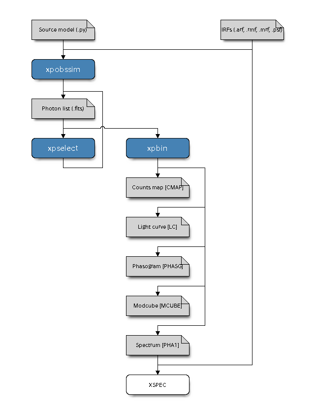

.. _architecture:

Architectural overview
======================

The vast majority of the simulation and data preparation facilities implemented
in ximpol are made available through three main *executables*, as illustred in
the block diagram below:

* ``xpobssim``: given a :ref:`source model <source_models>` and a set of
  :ref:`instrument response functions <response_functions>`, it produces a
  photon list correponding to a given observation time. The persistent
  incarnation of a photon list (that we call an *event file*) is binary FITS
  table whose format is defined  in :py:mod:`ximpol.evt.event`. 
* ``xpselect``: allows to select subsamples of photons in a given event
  file, based on the event energy, direction, time or phase (and, really, any
  of the columns in the photon list), producing a new (smaller) event file.
* ``xpbin``: allows to bin the data in several different flavors, producing
  counts maps and spectra, light curves, phasograms and *modulation cubes*
  (i.e., histograms of the measured azimuthal distributions in multiple
  energy layers).

Where applicable, the data formats are consistent with the common display and
analysis tools used by the community, e.g., the binned count spectra can be
fed into XSPEC, along with the corresponding response functions, for doing
standard spectral analysis (note that the response files used are the *same*
for the simulation and the analysis tasks.)

All the ximpol simulation and analysis tools are fully configurable via
command-line and the corresponding signatures are detailed here. In addition,
ximpol provides a pipeline facility that allow to script in Python all the
aforementioned functionalities (e.g., for time-resolved polarimetry this would
mean: create an observation simulation for the system under study, run
`xpselect` to split the photon list in a series of phase bins, run `xpbin` to
create suitable modulation cubes for each of the data subselections and
analyze the corresponding binned output files).

Implementation details
----------------------

The basic flow of the simulation for a single model component is coded in
:py:meth:`ximpol.srcmodel.roi.xModelComponentBase.rvs_event_list()`.
Notably, in order to take advantage of the efficient array manipulation
capabilities provided by numpy, the entire implementation is vectorized, i.e.
we don't have an explicit event loop in python.

Mathematically speaking, the simulation algorith can be spelled out in the form
of the following basic sequence:

1. Given the source spectrum :math:`\mathcal{S}(E, t)` and the effective area
   :math:`A_{\rm eff}(E)`, we calculate the count spectrum as a function of
   the energy and time:

   .. math::
      \mathcal{C}(E, t) = \mathcal{S}(E, t) \times A_{\rm eff}(E)
      \quad [\text{s}^{-1}~\text{keV}^{-1}].

2. We calculate the light curve of the model component (in counts space) by
   integrating over the energy:

   .. math::
      \mathcal{L}(t) = \int_{E_{\rm min}}^{E_{\rm max}} \mathcal{C}(E, t) dE
      \quad [\text{Hz}].

3. We calculate the total number of expected events :math:`N_{\rm exp}` by
   integrating the count rate over the observation time:

   .. math::
      N_{\rm exp} = \int_{t_{\rm min}}^{t_{\rm max}} \mathcal{L}(t) dt

   and we extract the number of *observed* events :math:`N_{\rm obs}` according
   to a Poisson distribution with mean :math:`N_{\rm exp}`.

4. We treat the count rate as a one-dimensional probability density function
   in the random variable :math:`t`, we extract a vector :math:`\hat{t}`
   of :math:`N_{\rm obs}` values of :math:`t` according to this pdf---and we
   sort the vector itself. (Here and in the following we shall use the hat
   to indicate vectors of lenght :math:`N_{\rm obs}`.)

5. We treat the array of count spectra :math:`\hat{\mathcal{C}}(E, \hat{t})`,
   evaluated at the time array :math:`\hat{t}`, as an array of one-dimensional
   pdf objects, from which we extract a corresponding array :math:`\hat{E}` of
   (true) energy values. (In an event-driven formulation this would
   be equivalent to loop over the values :math:`t_i` of the array
   :math:`\hat{t}`, calculate the corresponding count spectrum

   .. math::
      \mathcal{C}_i(E, t_i)

   and treat that as a one-dimensional pdf from which we extract a (true) energy
   value :math:`E_i`, but the vectorized description is more germane to what
   the code is actually doing internally.)

6. We treat the energy dispersion :math:`\hat{\mathcal{D}}(\epsilon; \hat{E})`
   as an array of one-dimensional pdf objects that we use to extract
   the measured energies :math:`\hat{\epsilon}` and the corresponding
   PHA values.

7. We extract suitable arrays of (true) :math:`\hat{\text{RA}}`,
   :math:`\hat{\text{Dec}}` values and, similarly to what we do with the energy
   dispersion, we smear them with the PSF in order to get the correponding
   measured quantities.

8. We use the polarization degree :math:`P` and angle :math:`\alpha` of the
   model component to calculate the visibility :math:`\hat{\xi}` and the phase
   :math:`\hat{\phi}_0` of the azimuthal distribution modulation, given the
   modulation factor :math:`\mu(E)` of the polarimeter

   .. math::
      \hat{\xi} =
      \hat{P}(\hat{E}, \hat{t}, \hat{\text{RA}}, \hat{\text{Dec}}) \times 
      \mu(\hat{E})
      
      \hat{\phi}_0 =
      \hat{\alpha}(\hat{E}, \hat{t}, \hat{\text{RA}}, \hat{\text{Dec}}),

   and we use these values to extract the directions of emission of the
   photoelectron.

(For periodic sources all of the above is done in phase, rather than in time,
and the latter is recovered at the very end using the source ephemeris, but
other than that there is no real difference.)

For source models involving more than one component, this is done for each
component separately, and the different resulting phothon lists are then
merged and ordered in time at the end of the process.

