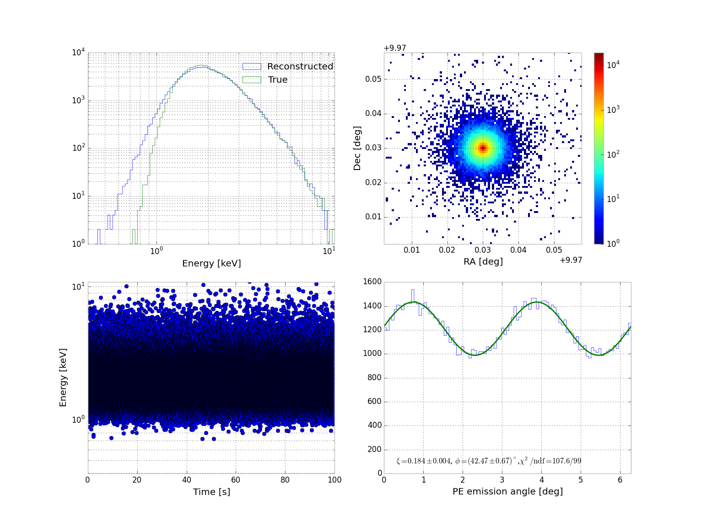
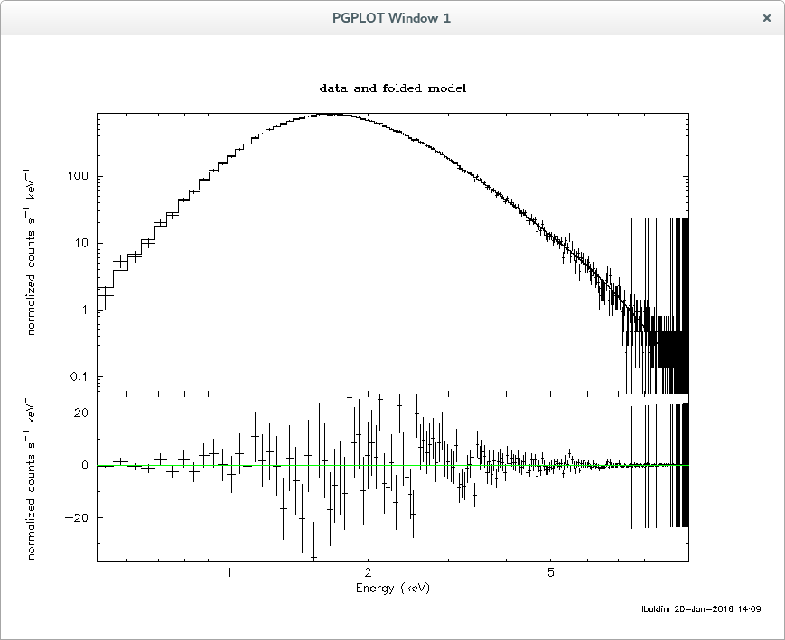

Quick start
===========

.. warning:: This is now already obsolete and we should revamp it
             to the latest ximpol versions.

The main purpose of this simulation package is to simulate an observation
of a given source model, based on suitable detector response functions. 

The main Monte Carlo simulation script is `ximpol/bin/xpobssim
<https://github.com/lucabaldini/ximpol/blob/master/ximpol/bin/xpobssim.py>`_
and its signature is

.. code-block:: bash

ximpol/bin/xpobssim.py
usage: xpobssim.py [-h] [--outfile OUTFILE] --configfile CONFIGFILE
                   [--irfname IRFNAME] [--duration DURATION] [--tstart TSTART]
                   [--seed SEED] [--vignetting {True,False}]
                   [--clobber {True,False}]

Assuming that the current working directory is the ximpol root folder, the
command

.. code-block:: bash

    ximpol/bin/xpobssim.py --configfile ximpol/config/single_point_source.py --duration 10000

should produce an event (FITS) file with a 10 ks simulation of a stationary
source with a power-law spectrum (with an index of 2 and normalization of 10)
with energy- and time-independent polarization degree and angle (correctly
folded with all the instrument response functions: effective area, modulation
factor, energy dispersion and point-spread function).
The format definition for the event file is in `ximpol/evt/event.py
<https://github.com/lucabaldini/ximpol/blob/master/ximpol/evt/event.py>`_.

Now in order to bin the event file in energy (from 2 keV to 8 keV in one single bin) we run the command

.. code-block:: bash

    ximpol/bin/xpbin.py ximpol/data/single_point_source.fits --algorithm MCUBE --emin 2. --emax 8. --ebins 1

that should produce a new FITS file (called modulation cube), containing the MDP value (at 99%) and the histogram of the azimuthal distribution of photoelectrons emission for every bin.

The binned output file can be easily visualized using the xpviewbin tool:

.. code-block:: bash

    ximpol/bin/xpviewbin.py ximpol/data/single_point_source_mcube.fits

We are already fully equipped for a basic spectral analysis with XSPEC. The first step is to bin again the event file by running the xpbin tool with the PHA1 algorithm.

.. code-block:: bash

    ximpol/bin/xpbin.py ximpol/data/single_point_source.fits --algorithm PHA1

Finally we can feed the binned file (along with the corresponding .arf and .rmf
response functions) into XSPEC and recover the input parameters of our source.

.. code-block:: bash

    ximpol/bin/xpxspec.py ximpol/data/single_point_source_pha1.fits

Note that xpspec.py is an example of how to use
`pyXspec <https://heasarc.gsfc.nasa.gov/xanadu/xspec/python/html/index.html>`_,
unfortunately not all of the XSPEC capabilties have been implemented in
pyXspec (for example how to save a plot) so it is left to the user to decide
whether to use XSPEC or pyXSPEC for the spectral analysis.

Below is the output from XSPEC on test.pha:

.. code-block:: bash

    Model powerlaw<1> Source No.: 1   Active/On
    Model Model Component  Parameter  Unit     Value
      par  comp
       1    1   powerlaw   PhoIndex            1.99866      +/-  7.42715E-04  
       2    1   powerlaw   norm                9.99055      +/-  7.66357E-03  
     ________________________________________________________________________

   Fit statistic : Chi-Squared =         188.76 using 191 PHA bins.

   Test statistic : Chi-Squared =         188.76 using 191 PHA bins.
    Reduced chi-squared =        0.99875 for    189 degrees of freedom 
    Null hypothesis probability =   4.911785e-01

