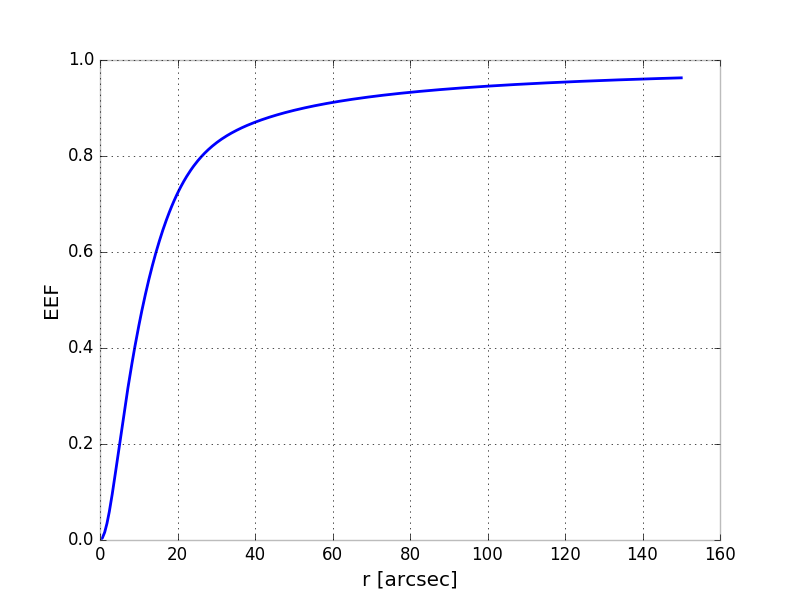
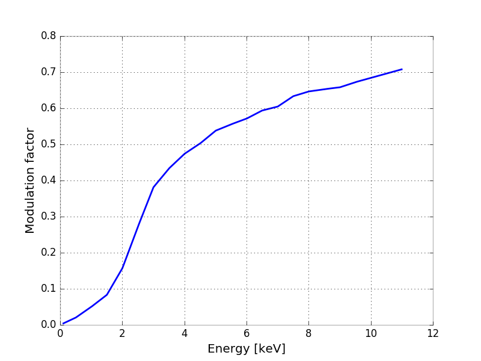
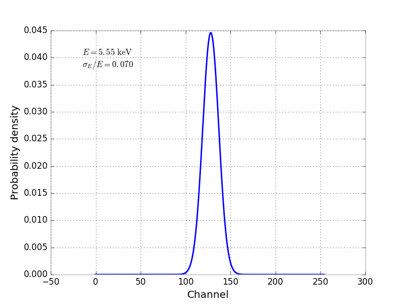

Instrument response functions (IRFs)
====================================

The instrument response functions are a crtical part of the package, and they
are used (in identical form) both in the event simulation and in the analysis
of the data products from the simulations.

All the response functions are stored in FITS files in the OGIP format defined
in `CAL/GEN/92-002
<http://heasarc.gsfc.nasa.gov/docs/heasarc/caldb/docs/memos/cal_gen_92_002/cal_gen_92_002.html>`_
(and modifications `CAL/GEN/92-002a
<http://heasarc.gsfc.nasa.gov/docs/heasarc/caldb/docs/memos/cal_gen_92_002a/cal_gen_92_002a.html>`_)
and are intended to be fully compatible with the spectral analysis tools
provided by `XSPEC <https://heasarc.gsfc.nasa.gov/xanadu/xspec/>`_ (see
`here <http://heasarc.gsfc.nasa.gov/docs/xanadu/xspec/fits/fitsfiles.html>`_
for more details).

We identify four different types of response functions, listed in the following
table.

=====================  =========  ======================== ===============
IRF Type               Extension  ximpol module            ximpol class
=====================  =========  ======================== ===============
Effective area         `.arf`     :py:mod:`ximpol.irf.arf` :py:class:`ximpol.irf.arf.xEffectiveArea`
Point-spread function  `.psf`     :py:mod:`ximpol.irf.psf` :py:class:`ximpol.irf.psf.xPointSpreadFunction`
Modulation factor      `.mrf`     :py:mod:`ximpol.irf.mrf` :py:class:`ximpol.irf.mrf.xModulationFactor`
Energy dispersion      `.rmf`     :py:mod:`ximpol.irf.rmf` :py:class:`ximpol.irf.rmf.xEnergyDispersion`
=====================  =========  ======================== ===============

(If you are familiar with basic spectral analysis in XSPEC, the `.arf` and
`.rmf` files have exactly the meaning that you would expect, and can be
in fact used in XSPEC).

ximpol provodes facilities for generating, reading displaying and using IRFs, as
illustrated below.

Creating an IRF set: XIPE
-------------------------

The python module `ximpol.detector.xipe.py
<https://github.com/lucabaldini/ximpol/blob/master/ximpol/detector/xipe.py>`_
generates a full set of instrument response functions for the baseline
XIPE configuration, and it's a sensible example of how to go about
generating IRFs for arbitrary detector configurations.

The XIPE effective area (shown in the figure below) is the product of two
distinct pieces:

* The collecting area of the XIPE optics, available in
  `aeff_optics_xipe_m4_x3.asc
  <https://raw.githubusercontent.com/lucabaldini/ximpol/master/ximpol/detector/data/aeff_optics_xipe_m4_x3.asc>`_
  in ascii format. (This is the overall area for the three telescopes.)
* The quantum efficiency of the MGD in the baseline configuration
  (Ne/DME 80/20, 1 atm, 1 cm absorption gap), available in
  `eff_hedme8020_1atm_1cm_cuts80p_be50um_p_x.asc
  <https://raw.githubusercontent.com/lucabaldini/ximpol/master/ximpol/detector/data/eff_hedme8020_1atm_1cm_cuts80p_be50um_p_x.asc>`_.
  (Mind this include the effect of the 50 um Be window and that of an
  energy-independent cut on the quality of the event to achieve the modulation
  factor predicted by the Monte Carlo.)

The point-spread function (PSF) is apparently difficult to estimate accurately
based on the design of the optics, as it depends substantially on on the
defects of the surfaces (i.e., you need some metrology on the actual mirrors).
For the XIPE baseline design we start by assuming a gaussian + King profile
with a HEW of 15 arcsec, with the exact same parametrization and parameters
values of `Fabiani et al. (2014) <http://arxiv.org/abs/1403.7200>`_.
For completeness, another paper of interest is `Romano et al. (2005)
<http://proceedings.spiedigitallibrary.org/proceeding.aspx?articleid=868815>`_.
Below is the actual profile of the PSF, which should be identical to
Figure 6 of Fabiani at al. (2014), the parameter values being taken from
Table 2 (@ 4.51 keV).

The modulation factor as a function of the energy for the relevant GPD
configuration is tabulated in `modfact_hedme8020_1atm_1cm_mng.asc
<https://raw.githubusercontent.com/lucabaldini/ximpol/master/ximpol/detector/data/modfact_hedme8020_1atm_1cm_mng.asc>`_
and shown in the figure below.

The energy dispersion (i.e., the content of the `.mrf` FITS files) contains
a two-dimensional table of the redistribution matrix in the PHA-true energy
space (the `MATRIX` extension), and a one-dimensional table containing the
correspondence between the PHA channels and the energy (the `EBOUNDS`
extension).

For the time being we are using a simple gaussian parametrization whose FWHM
as a function of the energy is tabulated in
`eres_fwhm_hedme8020_1atm_1cm.asc
<https://raw.githubusercontent.com/lucabaldini/ximpol/master/ximpol/detector/data/eres_fwhm_hedme8020_1atm_1cm.asc>`_.
We're using 256 channels between 0 and 11 keV, which seem to sample the
energy dispersion adequately across the entire energy range.

Loading (and using) IRFs
------------------------

All the instrument response functions are stored in FITS files (living in
`ximpol/irf/fits`) and have suitable interfaces to load and use them.
You load, e.g., the baseline XIPE effective area by doing:

>>> import os
>>> from ximpol import XIMPOL_IRF
>>> from ximpol.irf.arf import xEffectiveArea
>>> file_path = os.path.join(XIMPOL_IRF, 'fits', 'xipe_baseline.arf')
>>> aeff = xEffectiveArea(file_path)

(The same works for the other three IRFs. Note that ``XIMPOL_IRF`` is a
convenience variable that allows you to avoid machine-dependent absolute
paths and is always pointing to `ximpol/irf`, no matter what the package
is installed. There's many other such variables defined in `ximpol.__init__.py
<https://github.com/lucabaldini/ximpol/blob/master/ximpol/__init__.py>`_.)
You can also load all the four response functions at a time:

>>> from ximpol.irf import load_irfs
>>> aeff, psf, modf, edisp = load_irfs('xipe_baseline')

Ok, now that I got the IRF(s), what do I do with them? For one thing response
function objects are typically capable of evaluating themselves at any given
point---compare the outputs below with the plots at the top of the page.

>>> # Print the values of the effective area and the modulation factor and 3 keV
>>> print(aeff(3.))
>>> 164.870643616
>>> print(modf(3.))
>>> 0.380231711646
>>> # Print the value of the PSF at 20 arcsec
>>> print(psf(20.))
>>> 0.000131813525114

(The energy dispersion is a somewhat more complicated object, i.e., a
distribution whose parameters depend on the energy, for which this has no
real sense.) In passing, since internally we work with array, we can also
evaluate the response functions over arbitrary grids of points in one pass, e.g

>>> import numpy
>>> energy = numpy.linspace(1, 10, 10)
>>> print(energy)
>>> [  1.   2.   3.   4.   5.   6.   7.   8.   9.  10.]
>>> print(aeff(energy))
>>> [   4.9761498   305.13298991  164.87064362   68.54330826   31.6964035
>>>   16.27694702    7.43255687    3.34847045    1.49684757    0.62106234]

Response functions are also capable of plotting themselves and you might
want to check this out:

>>> aeff.plot()

Most importantly, IRFs have facilities to throw random number according to
suitable distributions to generate list of events, but this is covered
in another section.

The small application `bin/xpxirfview.py` provide a common interface to
display the content of IRF FITS files

>>> $ximpol/bin/xpirfview.py ximpol/irf/fits/xipe_baseline.arf

           
