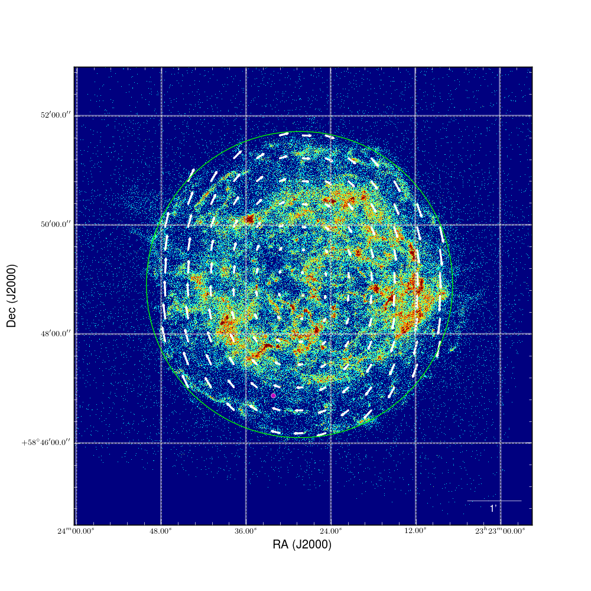
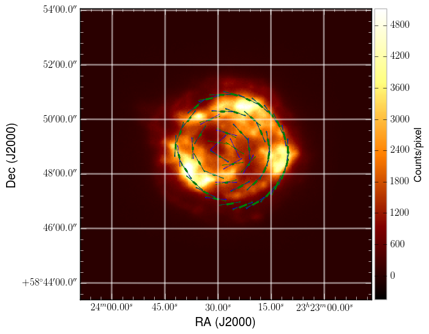

.. _showcase:

Showcase
========

Here are a few source models and simulation outputs illustrating some of the
basic ximpol capabilities.

.. _showcase_casa

Cas A
-----

**Input model**

Full source model definition in `ximpol/config/casa.py
<https://github.com/lucabaldini/ximpol/blob/master/ximpol/config/casa.py>`_.

The spectral model is taken (by hand) from Figure 5 of E.A. Helder and J. Vink,
*"Characterizing the non-thermal emission of Cas A"*, `Astrophys. J. 686 (2008)
1094--1102 <http://arxiv.org/abs/0806.3748>`_. The spectrum of
Cas A is a complex superposition of thermal and non thermal emission, and
for our purposes, we call *thermal* anything that is making up for the lines
and *non-thermal* all the rest, as illustrated in the figure below.

.. image:: figures/showcase/casa_model_spectrum.png
   :width: 75%
   :align: center

The morphology of the source is energy-dependent in a non trivial way.
We start from two Chandra images (in the 1.5--3 keV and 4--6 keV energy ranges,
respectively) and associate the former to the thermal spectral component
and the latter to the non-thermal one (note the absence of spectral lines
between 4 and 6 keV).

.. image:: figures/showcase/casa_model_le_image.png
   :width: 49.6%

For the polarization, we assume that the thermal component is unpolarized,
while for the non-thermal component we use a simple geometrical, radially
symmetric model (loosely inspired from radio observations) where the
polarization angle is tangential and the polarization degree is zero at the
center of the source and increases toward the edges (see figure below).
 

           
Our total model of the region of interest is therefore the superposition of
two indipendent components, with different spectral, morphological and
polarimetric properties. Crude as it is, it's a good benchmark for the
observation simulator.

**Simulation output**

Generation/analysis pipeline in `ximpol/examples/casa.py
<https://github.com/lucabaldini/ximpol/blob/master/ximpol/examples/casa.py>`_.

Below is a binned count map of a 250 ks simulated XIPE observation of Cas A,
based on the model described above.

.. image:: figures/showcase/casa_cmap.png
   :width: 75%
   :align: center

When the entire source is analyzed at once, most of the polarization averages
out and even in the high-energy band, where the emission is predominantly
non-thermal, the residual polarization degree resulting from the averaging
of the different emission regions is of the order of 5%.

.. image:: figures/showcase/casa_mod_he.png
   :width: 49.6%

On the other hand, spatially- and energy-resolved polarimetry would in this
case reveal much of the richness in the original polarization pattern.
Below is an example of the azimuthal distributions in the two energy bands
for the circular region of interest indicated by the white circle in the left
plot. (The green and blue lines in the ROI indicate the reconstructed
polarization angle.) The comparison with the previous, spatially averaged
distributions is striking.

.. image:: figures/showcase/casa_reg0009_mcube.png
   :width: 100%

By mapping the entire field ov view with suitable regions of interest we can
in fact (at least qualitatively) recover the input polarization pattern,
as shown in the figre below. (Note that at the center of the image the
polarization is close to zero and the arrows have little meaning.)

           

The Crab pulsar
---------------

**Input model**

Full source model definition in `ximpol/config/crab_pulsar.py
<https://github.com/lucabaldini/ximpol/blob/master/ximpol/config/crab_pulsar.py>`_.

The input model consists of tabulated models for the phase-resolved
optical polarization angle and degree and X-ray spectral parameters.
The main reference we used for the compilation is Weisskopf, M. C. et al.,
*"Chandra Phase-Resolved X-Ray Spectroscopy of the Crab Pulsar"*, 
`Astrophys. J. 743 (2011) 139--149 <http://arxiv.org/abs/1106.3270>`_
and essentially all the data points come from Figure 4 of this paper.

For any specific phase value the polarization angle and degree are
energy-independent (and, in the absence of X-ray data, we just assume that
they are the same as the values measured in optical) and the spectral model is
a simple power law (with the normalization and spectra depending on the phase).
The sinusoidal parametrization of the power-law index as a function of the
pulsar phase, mutuated from the reference above, is somewhat unphysical, but
from our prospective is a good test of the simulation chain.

The input spatial model is simply a point source. The timing ephemeris is
taken from Weisskopf, M. C. et al., *"Chandra Phase-Resolved X-Ray
Spectroscopy of the Crab Pulsar"*, `Astrophys. J. 601 (2004) 1050--1057
<http://arxiv.org/abs/astro-ph/0310332>`_.

**Simulation output**

Generation/analysis pipeline in `ximpol/examples/crab_pulsar.py
<https://github.com/lucabaldini/ximpol/blob/master/ximpol/examples/crab_pulsar.py>`_.

All the plots below refer to a 100 ks simulation of the Crab pulsar.
(It is worth emphasizing that in this particular context we only simulate the
pulsar---not the nebula. Simulating the Crab complex can surely be done within
the current capabilities of the framework, but for this particular example
we did not want to make the downstream analysis too complicated.)

We splitted the sample into 20 phase bins and created counts spectra (i.e.,
PHA1 files) and modulation cubes for each of the phase bins.

We fitted the count spectra in each phase bin with XSPEC, and the fitted
parameters track reasonably well the input model. We might be seeing a slight
bias in the values of the spectral index toward sistematically higher values,
but overall things do look good.

.. image:: figures/showcase/crab_pl_norm.png
   :width: 75%
   :align: center
.. image:: figures/showcase/crab_pl_index.png
   :width: 75%
   :align: center

We measure the average polarization degree and angle in each phase bin
(we remind that the input polarization model is energy-independent) and,
again, model and simulation agree well across all the phase values.

.. image:: figures/showcase/crab_polarization_degree.png
   :width: 75%
   :align: center
.. image:: figures/showcase/crab_polarization_angle.png
   :width: 75%
   :align: center

GRB 130427A
-----------

**Input model**

Full source model definition in `ximpol/config/grb130427_swift.py
<https://github.com/lucabaldini/ximpol/blob/master/ximpol/config/grb130427_swift.py>`_.

This example is meant to illustrate the simulation of a time-dependent source
model. GRB 130427A (at z = 0.34) is one of the brightest GRBs ever observed in
X-rays. The data points to build the light curve (shown below) are taken
from the `Swift XRT light-curve catalog
<http://www.swift.ac.uk/xrt_curves/00554620/>`_.

For the polarization, we made up a model where the polarization degree
is decreasing with time (starting at about 40% and reaching about 10% 1 Ms
after the burst) and the polarization angle is constant (see the input
models in the simulation output below).

**Simulation output**

We simulated a 1 Ms observation of the GRB with XIPE. The plot below shows
the count rate as a function of time.

We subselected the event file into non-overlapping time slices whose
width is increasing logaritmically with time. Below are the reconstructed
polarization degree and angle in each of the time bins, with the corresponding
input model overlaid. Most notably, if we were able to repoint the
telescope to the GRB direction within a day from the burst, we would still
be sensitive to a 10--20% polarization degree in an intergration time of the
order of 100 ks.

           

